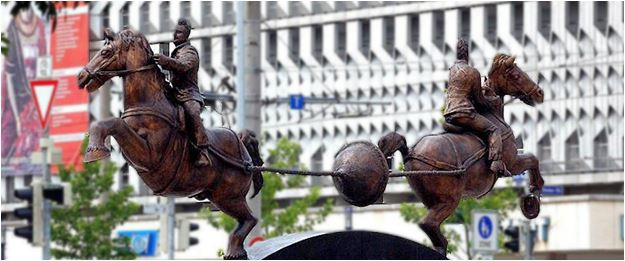

% [少年科技人雜誌](http://programmermagazine.github.com/ymag/)
% 2015 年 10 月
% 本期焦點：從射線到原子彈

# 前言
## 編輯小語

變形金剛裡說，近代科學的所有成果都是從麥加登身上學來的。

但是在真實的科學世界裡，如果要說有個能源火種的話，那必然是『陰極射線管』了，近代科學的一切，都是從『陰極射線管』的基礎上探索得到的。

透過射線的研究，物理學家找到了一條從陰極射線管通往原子核的路，然後在從中子一路發展出核武器與核能。

研究射線最經典的人物我覺得是拉賽福，因為他除了提出原子模型之外，還預測了中子的存在，並且培養出了十位獲得諾貝爾獎的學生。

如果沒有『陰極射線管』的話，那麼『示波器、電視機、電腦螢幕』等等裝置，那麼我們現在的世界肯定會長得很不一樣。

在本期的「少年科技人雜誌」中，我們將透過「射線」這個主題，帶領您探索近代科學當中非常迷人的一段歷史。

---- （「少年科技人雜誌」與「程式人雜誌」編輯 - 陳鍾誠）

## 授權聲明

本雜誌許多資料修改自維基百科，採用 創作共用：[姓名標示、相同方式分享] 授權，若您想要修改本書產生衍生著作時，至少應該遵守下列授權條件：

1. 標示原作者姓名 (包含該文章作者，若有來自維基百科的部份也請一併標示)。
3. 採用 創作共用：[姓名標示、相同方式分享] 的方式公開衍生著作。

另外、當本雜誌中有文章或素材並非採用 [姓名標示、相同方式分享] 時，將會在該文章或素材後面標示其授權，此時該文章將以該標示的方式授權釋出，請修改者注意這些授權標示，以避免產生侵權糾紛。

例如有些文章可能不希望被作為「商業性使用」，此時就可能會採用創作共用：[姓名標示、非商業性、相同方式分享] 的授權，此時您就不應當將該文章用於商業用途上。

最後、懇請勿移除公益捐贈的相關描述，以便讓愛心得以持續散播！

# 本期焦點： 從射線到原子彈
## 射線的歷史

關於射線的一切，得從一個不太相干的事件開始講起！

17 世紀時，東羅馬帝國的佛羅倫斯，由於建造高樓的關係，需要使用真空幫浦抽水，但是他們只能讓水抽到大約十米高，就沒辦法再往上了。

於是宮廷找來《伽利略》這位科學家，想要解決這個問題，但是《伽利略》一直到死前都沒解決。

後來《托里拆利》繼《伽利略》之後成為《托斯卡納伯爵》的宮廷物理學家，繼續研究這個問題，他採用《水銀》來進行實驗，發現一根長的水銀管倒立在水銀槽裏時，幾乎都只能升到 76 公分的地方，於是超過 76 公分的水銀管上端，會留下一個沒有水銀的區域，這個區域後來被稱為《托里拆利真空》。

《奧托·馮·居里克》(Otto von Guericke) 知道《托里拆利》之後，設計了一台「真空幫浦」，並用這個幫浦將分成兩半的空心銅球中間抽空，然後找來 30 批馬 (兩邊各 15 匹)，結果不管馬如何用力拉，都沒辦法將銅球拉開。這個實驗展示給神聖羅馬皇帝斐迪南三世看了之後，引起了很多人的關注，這就是著名的「馬德堡半球實驗」。

《奧托·馮·居里克》的真空幫浦，看來和射線應該沒有甚麼關係吧！ 

那麼、為甚麼我們的故事要從這裡講起呢？

且聽我細細道來！

「真空幫浦」發明後，有些物理學家開始進行「稀薄空氣」中「電的試驗」，他們發現在稀薄空氣中的電弧會比在一般空氣中的長，但是卻不清楚背後的原理。

1838 年時，《麥可·法拉第》在充滿稀薄空氣的玻璃管中輸送電流，結果發現在陰極和陽極之間之間有一道奇怪的光弧，但是只有直接在陰極前沒有這道光弧，這個地方被稱為「陽級暗區」，後來人們還發現到不管在稀薄空氣裡施加多少電壓總是會產生出光。

1857 年時，德國玻璃工海因里希·蓋斯勒 (Heinrich Geissler) 發明了更好的泵來抽真空，由此發明了能使管內的氣體發光的蓋斯勒管(Geissler tube) (霓虹管)。

上述現象讓人們對這些幾近真空的管子更為好奇，於是很多物理學家開始研究這些現象，結果在 1870 年左右，英國威廉·克魯克斯 William Crookes 因此發明了克魯克斯管，這就是最早的「陰極射線管」。

「陰極射線管」的發明，開啟了物理上對「電、磁、原子」等概念的大門，如果沒有「陰極射線管」，現代科學的歷史恐怕會全面改寫。

接下來的事情就是，一大堆物理學家都用「陰極射線管」去進行大轟炸，到處轟各種物質，看看會有甚麼反應。

結果這些微型轟炸一個接著一個帶領我們進入「近代物理」的世界，轟出了一堆諾貝爾獎，也轟出了原子彈，以下是關於這些轟炸的後續研究結果：

1. 1887年，尼古拉·特斯拉使用自己設計的高電壓真空管與克魯克斯管研究X射線。他發明了單電極X射線管，在其中電子穿過物質，發生了現在叫做軔致輻射的效應，生成高能X射線。但是他並沒有使用X射線這個名字，而只是籠統成為放射能。
2. 1895年，德國科學家倫琴開始進行陰極射線的研究。1895年12月28日他完成了初步的實驗報告「一種新的射線」，這種射線的特性是不會受磁場影響而偏折。他把這項成果發布在維爾茨堡的Physical-Medical Society雜誌上。為了表明這是一種新的射線，倫琴採用表示未知數的X來命名，稱為 X 射線，後來倫琴在 1901 年獲得諾貝爾物理學獎。
3. 後來 1896 時法國科學家亨利·貝可勒爾在研究磷光材料時發現放射性現象，但他誤以為燐光才是原因。後來很快就發現上述的感光和磷光無關．因為使用非磷光材料的鈾鹽甚至鈾金屬，也會有一樣的效果。因此推斷有一種不可見的輻射可以穿過黑色紙張，使底片感光而變黑。這種由放射性物質射出的射線，就被稱為放射線。
4. 在 1897 年時德國卡爾斯魯厄，布勞恩在陰極射線管的另一端均勻地塗上一層硫化鋅或其他礦物質細粉，做成螢光屏，後來他的助手澤奈克（Zenneck）為陰極射線管增加了另一個方向的電磁偏轉，電子束打在上面可以產生黃綠色的明亮光斑。接著他們發明了 CRT 管， CRT 管讓陰極射線成為良好可操控的工具，而且成了後來電視機的基本元件。

後來、在陰極射線的後續研究上，有位重要的人物出現了，那就是拉塞福。

『拉塞福』師承『J.J.湯普生』，並且教出了近十位諾貝爾獎得主，這些人不斷地運用射線去轟擊原子，因而將原子的『太陽系模型』建構出來，並且發現『電子，質子，中子』等粒子。

當『放射性元素』與『中子』被發現之後，操控這些物質的技術就越來越進步了。

後來當德國科學家『奧托·漢因』和『弗里茨·施特拉斯曼』兩人發現用一種慢中子來轟擊鈾核時，會導致鈾核分裂成幾乎相等的兩半，並且釋放出很高的能量，這種反應就是鈾235的裂變。

更重要的是，這種核分裂反應，還會釋放出兩個高速中子，這些中子又去撞到別的鈾核，於是導致一變二，二變四的連鎖反應，導致可怕的核分裂型爆炸。

鈾235裂變的技術，就是原子彈之所以被創造出來的關鍵原因。而裂變技術的來源，正是透過射線去進行原子核實驗所發展出來的。

以下是筆者所整理有關射線的歷史，有興趣的讀者可以參考看看！

<table>
<tr><th style="min-width:6em">分類</th><th style="min-width:4em">年代</th><th>事件</th></tr>
<tr><td>陰極射線</td><td>1690</td><td>奧托·馮·格里克發明真空泵後物理學家開始在稀薄空氣中做電的試驗 </td></tr>
<tr><td>陰極射線</td><td>1705</td><td>人們發現在稀薄空氣中的電弧比在一般空氣中的長</td></tr>
<tr><td>陰極射線</td><td>1838</td><td>麥可·法拉第充滿稀薄空氣的玻璃管中輸送電流，他發現在陰極和陽極之間之間有一道奇怪的光弧。只有直接在陰極前沒有這道光弧，這個地方被稱為「陽級暗區」。後來人們還發現到不管在稀薄空氣裡施加多少電壓總是會產生出光</td></tr>
<tr><td>陰極射線</td><td>1857</td><td>德國玻璃工海因里希·蓋斯勒 (Heinrich Geissler) 發明了更好的泵來抽真空，由此發明了能使管內的氣體發光的蓋斯勒管(Geissler tube) (霓虹管) </td></tr>
<tr><td>陰極射線</td><td>1858</td><td>德國物理學家尤利烏斯·普呂克觀察到一種陰極螢光現象</td></tr>
<tr><td>陰極射線</td><td>1869</td><td>物理學家約翰·威廉·希托夫觀察到真空管中的陰極發出的射線，有人則發現管壁也會發光，而且只有在陽極的一端會發光</td></tr>
<tr><td>陰極射線</td><td>1869-1875</td><td>英國威廉·克魯克斯 William Crookes 因此發明了克魯克斯管 Crookes tube (最早的陰極射線管) ，專門用來研究這樣發出的光</td></tr>
<tr><td>陰極射線</td><td>1876</td><td>德國物理學家歐根·戈爾德斯坦確認並將其命名為陰極射線</td></tr>
<tr><td>陰極射線</td><td>1880</td><td>某日，湯瑪斯·愛迪生好奇地在燈泡中多放了一個電極，且灑了點箔片，結果發現了奇特的現象：第三極通正電時，箔片毫無反應；但通負電時，箔片隨即翻騰漂浮。當時愛迪生不知道此現象的起由，但由於他不經意的發現，這個現象後來被稱為愛迪生效應</td></tr>
<tr><td>X射線</td><td>1887</td><td>尼古拉·特斯拉開始使用自己設計的高電壓真空管與克魯克斯管研究X射線。他發明了單電極X射線管，在其中電子穿過物質，發生了現在叫做軔致輻射的效應，生成高能X射線射線</td></tr>
<tr><td>陰極射線</td><td>1892</td><td>赫茲進行實驗，提出陰極射線可以穿透非常薄的金屬箔。赫茲的學生倫納德進一步研究這一效應，對很多金屬進行了實驗</td></tr>
<tr><td>X射線</td><td>1895</td><td>侖琴   (Wilhelm Konrad Rontgen, 1845~1923) 發現陰極射線管會發出不受磁場偏折的射線，因此推定不帶電荷， 於是稱為 X 射線</td></tr>
<tr><td>放射線</td><td>1896</td><td>法國科學家亨利·貝可勒爾在研究磷光材料時發現放射性現象，但他誤以為燐光才是原因。後來很快就發現上述的感光和磷光無關．因為使用非磷光材料的鈾鹽甚至鈾金屬，也會有一樣的效果。因此推斷有一種不可見的輻射可以穿過黑色紙張，使底片感光而變黑</td></tr>
<tr><td>陰極射線</td><td>1897</td><td>在德國卡爾斯魯厄，布勞恩在陰極射線管的另一端均勻地塗上一層硫化鋅或其他礦物質細粉，做成螢光屏，後來他的助手澤奈克（Zenneck）為陰極射線管增加了另一個方向的電磁偏轉，電子束打在上面可以產生黃綠色的明亮光斑。隨著側壁上擺放的平行板電極電壓的變化，電子束的偏轉也隨之變化，從而在螢光屏上形成不同的亮點，稱為「掃描」。螢光屏上光斑的變化，呈現了控制電子束偏轉的平行板電極電壓的變化，也就是所研究電波的波動圖象，這是示波器的雛形和基礎，它使得對電波的直觀觀察成為可能。現在CRT被廣泛應用在電視機和計算機的顯示器上，在德語國家，CRT仍被稱為「布勞恩管」。 
當時布勞恩的助手曾提出用陰極射線管做電視的顯示器，固執的布勞恩卻認為這是不可能的。</td></tr>
<tr><td>真空管</td><td>1901</td><td>歐文·理查森提出定律，說明電子的激發態引起箔片漂浮，後更以此拿到1928年的諾貝爾物理獎</td></tr>
<tr><td>真空管</td><td>1904</td><td>約翰·弗萊明發展出二極管</td></tr>
<tr><td>畫面顯示器</td><td>1906</td><td>德國物理學家卡爾·布勞恩的兩位助手用這種陰極射線管製造了一台畫面接收機，進行圖像重現。但他們的這種裝置重現的是靜止畫面，應該算是傳真系統而不是電視系統。</td></tr>
<tr><td>真空管</td><td>1907</td><td>李·德佛瑞斯特（Lee De Forest）作出第一個三極管</td></tr>
<tr><td>蓋革計數器</td><td>1907</td><td>蓋革計數器最初是在1908年由德國物理學家漢斯·蓋革和著名的英國物理學家盧瑟福在α粒子散射實驗中，為了探測α粒子而設計的。後來在1928年，蓋革又和他的學生米勒（Walther Müller）對其進行了改進，使其可以用於探測所有的電離輻射。1947年，美國人Sidney H. Liebson在其博士學位研究中又對蓋革計數器做了進一步的改進，使得蓋革管使用較低的工作電壓，並且顯著延長了其使用壽命。這種改進也被稱為「鹵素計數器」</td></tr>
<tr><td>電視系統</td><td>1907</td><td>1907年至1910年，波瑞斯·羅星（Boris Rosing）和他的學生弗拉基米爾·佐利金（Vladimir Zworykin）驗證了在發射機中用快速轉動的鏡面掃描裝置和在接收機中使用陰極射線管（cathode ray tube）的電視系統</td></tr>
<tr><td>油滴實驗</td><td>1909</td><td>美國物理學家羅伯特·密立根做了一個著名實驗，稱為油滴實驗，可以準確地測量出電子的帶電量。在這實驗裏，他使用電場的庫侖力來抵銷帶電油滴所感受到的重力。從電場強度，他計算出油滴的帶電量。他的儀器可以準確地測量出含有1到150個離子的油滴的帶電量，而且實驗誤差可以限制到低於0.3%。他發現每一顆油滴的帶電量都是同一常數的倍數，因此，他推論這常數必是電子的帶電量</td></tr>
<tr><td>金箔實驗</td><td>1909</td><td>蓋革－馬士登實驗（Geiger-Marsden experiment），又稱拉塞福散射實驗，是1909年漢斯·蓋革和歐內斯特·馬士登（Ernest Marsden）在歐內斯特·拉塞福指導下於英國曼徹斯特大學做的一個著名散射實驗。實驗是用α粒子轟擊金箔，發現絕大多數α粒子的被金原子散射的偏向很小，但少數的偏向角很大甚至大於90度。由此可以證明，一個原子大部分的體積是空的空間，這由沒有被彈回的粒子充分說明。這個實驗推翻了約瑟夫·湯姆森認為原子內正負電荷在空間均勻分布的「均勻原子核模型」。為建立現代原子核理論打下了基礎。</td></tr>
<tr><td>原子模型</td><td>1911</td><td>拉塞福總結出原子的模型的公式。該模型認為，包含大部分原子質量的帶正電的小核被小質量的電子環繞。他的學生中總共有丹麥的波耳、德國的哈恩、前蘇聯的卡皮察等十位諾貝爾獎得主。但是拉塞福的原子模型引發一個問題，氫原子只有一個質子，氦原子有兩個質子，但是兩者質量比卻不是 1:2 ，而是 1:4 </td></tr>
<tr><td>電視系統</td><td>1911</td><td>1911年，工程師艾倫·坎貝爾·斯文頓（Alan Archibald Campbell-Swinton）在倫敦發表演講，同時在時代雜誌中也被報道，描述了如何在發送端和接收端同時使用陰極射線管傳輸電視信號的細節。在演講中，他還補充了在1908年撰寫的雜誌文章自然雜誌中第一次描述的電子電視傳送方法，這種傳送方法沿用至今。 </td></tr>
<tr><td>同位素</td><td>1912</td><td>同位素 (isotopes) ： 質子數相同，但中子數不同的元素 （質量數 M=質子數 P+中子數 N)，可以寫為 $_P^M X$ ，其中 A 為質量數。 (例如：氫=質子 1+中子 0 = $_1^1  H$ | 氘=質子 1+中子 1 $_1^2 H$ | 氚=質子 1+中子 2 = $_1^3  H$ ) 弗雷德里克·索迪藉由衰變鏈分析，證實同位素存在。約瑟夫·湯姆孫在1913年首次發現穩定元素同位素的證據。弗朗西斯·阿斯頓通過實驗，證明了氖的兩種同位素的存在。</td></tr>
<tr><td>質譜儀</td><td>1919</td><td>弗朗西斯·威廉·阿斯頓（Francis William Aston，1877年9月1日－1945年11月20日），英國化學家、物理學家，英國皇家學會院士，俄羅斯科學院榮譽院士。由於「藉助自己發明的質譜儀發現了大量非放射性元素的同位素，以及闡明了整數法則」，他被授予1922年諾貝爾化學獎</td></tr>
<tr><td>中子理論</td><td>1920</td><td>拉塞福首先提出了中子存在的可能性，認為電中性的粒子是由一個電子環繞一個質子構成</td></tr>
<tr><td>中子線索</td><td>1931</td><td>德國物理學者瓦爾特·博特和赫伯特·貝克爾發現用釙的高能α粒子轟擊鈹、硼或鋰這些較輕的元素，會產生一種貫穿力極強的輻射。開始他們認爲這種輻射是伽馬射線。但是未知輻射比任何已知伽馬射線貫穿力都強，而且實驗結果很難用伽馬射線來解釋。</td></tr>
<tr><td>中子線索</td><td>1932</td><td>居里夫婦發現，如果用這種未知輻射照射石蠟和其他富含氫的化合物，就會釋放出高能質子。雖然這個結果同高能伽馬射線一致，但細緻的數據分析表明未知輻射是伽馬射線的假説越來越牽強</td></tr>
<tr><td> 中子發現 </td><td>1932</td><td>查兌克 （James Chadwick , 1891~1972) 用 α 粒子撞擊鈹箔，結果撞出第三種粒子，該粒子為電中性，於是證實了中子 (neutrons) 理論</td></tr>
<tr><td>核分裂現象</td><td>1938</td><td>納粹德國科學家奧托·漢因和弗里茨·施特拉斯曼發現了核分裂現象，此現象也被刊登於科學雜誌上。1938年末，當他們用一種慢中子來轟擊鈾核時，竟出人意料地發生了一種異乎尋常的情況：反應不僅迅速強烈、釋放出很高的能量，而且鈾核分裂成為一些原子序數小得多的、更輕的物質成分。後來，哈恩經過多次試驗驗證，終於肯定了這種反應就是鈾235的裂變。</td></tr>
<tr><td>原子彈原理</td><td>1939</td><td>鈾-235和鈽-239此類重原子核在中子的轟擊後，通常會分裂變成兩個中等質量的核，同時再放出2到3個中子和200兆電子伏的能量。在裂變中放出的中子，一些在裂變系統中損耗了，而一些則繼續進行重核分裂（繼續轟擊重原子核）反應。只要在每一次的核分裂中所裂變出的中子數平均多餘一個（即中子的增值係數大於1），那麼核分裂即可以繼續進行，一次一次的反應後，裂變出的中子總數以指數形式增長，而產生的能量也隨之劇增。如果不加控制，最終，這個裂變系統會變為一個劇烈的鏈式裂變反應</td></tr>
<tr><td>原子彈誕生</td><td>1945</td><td>1939年，匈牙利科學家格拉德擔心德國製造出核武器，希望美國政府能夠先行研製出，但是當他找到一些官員時，他們認為只是天方夜譚，最終，他只得找到愛因斯坦。  
1939年8月2日，在愛因斯坦與其他幾名科學家一同致信美國總統羅斯福，建議美國政府務必在納粹德國前研製出核武器。羅斯福並沒有對此表示重視，而負責轉交信件的羅斯福的科學顧問亞歷山大·薩克斯擔負起了說服羅斯福的責任，他引用了一個著名的例子：當年拿破崙沒有採取富爾頓蒸汽船的建議，使其沒有建立起強大的海軍，最終不敵英國海軍。羅斯福被薩克斯說服，決定研製核武器。 

1939年10月19日，羅斯福正式簽署了研製原子彈的文件，兩日後，美國成立了「研究原子武器的委員會」，代號為S-11。 

1941年12月7日，日本轟炸的美國海軍軍港「珍珠港」，這使得美國政府更加下定決心加速執行他們的「核計劃」。 

1942年6月，美國原子彈研製計劃正式開始，由於總部設在美國紐約的曼哈頓區，所以此項計劃又被稱為「曼哈頓計劃」。同月，美國總統羅斯福與英國首相邱吉爾在華盛頓會晤，兩國決定聯合研製原子彈，即把英國原有的「合金管」計劃融入到「曼哈頓計劃」中。而此前逃亡到英國的一些法國科學家此時也加入到原子彈研究中 

1942年，洛斯阿拉莫斯實驗室在新墨西哥州一望無際的沙漠上建立了起來。 

1945年7月初，美國終於研製出了三枚原子彈，他們立即準備著手實驗。當得知要進行原子彈實驗時，美國總統杜魯門推遲了波茨坦會議時間，因為其希望該武器能夠在波茨坦會議期間爆炸，以提高美國的國際地位。 

7月15日，杜魯門到達波茨坦。7月16日5時29分45秒，人類歷史上的首枚原子彈在阿拉莫戈多沙漠上爆炸。實驗極其成功 

1945年8月6日早上8點15分，艾諾拉·蓋號在廣島上空投下人類歷史上第一枚用於戰爭的槍式原子彈（小男孩原子彈），造成廣島十萬多居民死亡。 

1945年8月9日，B-29轟炸機大貨櫃在長崎上空投下收聚式原子彈胖子原子彈，導致長崎市近四萬人直接死亡，總計十四萬人員死傷。 

1945年8月15日日本標準時間中午12點，裕仁天皇宣布日本投降，第二次世界大戰結束。
</td></tr>
<tr><td>氫彈</td><td>1951</td><td>
氫彈（又稱熱核武器），核武器的一種。主要利用氫的同位素（氘、氚）的核融合反應所釋放的能量來進行殺傷破壞。就其原理來說，它並不是「純凈」的核融合武器；確切的說，它應該叫「三相彈」，也稱作「氫鈾彈」 
它的核裝料中，最外部是鈾-238，裡面包裹著一個氫彈。它的特點是，藉助熱核反應產生的大量中子轟擊鈾-238，使鈾-238發生裂變反應。這種氫鈾彈的威力非常大，放射性塵埃特別多，所以是一種「骯髒」的氫彈。  
1949年9月蘇聯的原子彈爆炸實驗成功，使美國大為震驚，從便於戰略考慮必須製造出威力更大的炸彈。
1950年1月美國總統杜魯門決定研製氫彈。氫彈的研究工作由匈牙利籍的科學家愛德華·泰勒領導，利用原子彈促進爆炸時產生的高溫，使氘發生核融合反應。 
1951年5月，氫彈原理試驗準備工作就序，試驗彈代號「喬治」，在太平洋上的恩尼威托克島試驗場進行。極其笨重（達62噸）的試驗裝置放在60餘米的鋼架上，裝置以液態氘作為核融合原料，並有冷卻系統使氘處於極低溫。試驗證明爆炸威力大大超過原子彈。 
1952年11月1日又一個氫彈試驗裝置「常春藤麥克」在太平洋的埃內韋塔克環礁上爆炸。該裝置高6米，直徑為1.8米，重達65噸，看上去像個大暖瓶，爆炸威力達1000萬噸TNT當量。相當於廣島型原子彈的500倍。「常春藤麥克」體積比一輛載重汽車還大，它必須裝有笨重的製冷系統，這樣的裝置飛機、飛彈都無法運載，沒有什麼實戰價值。 

1953年8月，蘇聯宣布氫彈試驗成功，當量40萬噸。其方案是採用鋰的一種同位素鋰─6和氘的化合物──氘化鋰作核燃料。氘化鋰是固體，不需冷卻壓縮，製作成本低、體積小、重量輕、便於運載。這種氫彈稱為「乾式」氫彈，所以蘇聯是第一個成功把氫彈實用化的國家。1954年，美國的第一顆實用型氫彈在比基尼島試驗成功 
隨後英國於1957年5月15日擁有氫彈。中國於1966年12月28日成功地進行氫彈原理試驗，當量30萬噸，1967年6月17日由飛機空投的330萬噸當量的氫彈試驗獲得成功。法國於1968年8月也擁有氫彈。 
</td></tr>
<tr><td>中子彈</td><td>1962</td><td>
中子彈又稱強型輻射彈（英語：enhanced radiation bombs），是一種靠微型原子彈引爆的超小型氫彈，外層用鈹反射層包著，它只產生少量衝擊波和紅外線，僅為一般核爆炸的十分之一，但釋放大量中子束，中子可自由逸出，使放射性沾染的範圍比較小。中子的貫穿能力極強，佔總能量的80%左右，而中子作為一種微粒子，能夠輕易穿透裝甲車輛、建築物、磚牆去殺傷人員，而裝甲車輛、建築物和武器卻能完好的保存下來。 
中子彈對付生物的原理，是當大量的中子束進入人體後，能夠破壞人體細胞組織和中樞神經系統。當人體吸收的中子束達到一定劑量時，就會在短時間內失去戰鬥力甚至死亡。在輻射吸收特點上，低序數元素、含氫量高的化合物也容易大量吸收和阻擋中子，這點與X射線、伽馬射線這些電離輻射的吸收特性有所差別，後者更容易被高原子序數元素吸收和阻擋。 
美國於1958年開始由塞姆·科恩（Samuel Cohen）著手於中子彈的研發，雖然總統甘迺迪曾反對過中子彈的發展，1962年由勞倫斯利福摩爾國家實驗室首先發展成功，並在內華達州引爆。當時發展的理由是為了阻止蘇軍坦克群入侵西歐，僅使作戰人員死亡或受傷，而武器、通訊等完好如初。 
1978年美國總統卡特執政時期中子彈正式投入生產，1981年雷根時期為了加強軍備，下令生產長矛飛彈的中子彈頭和203毫米榴彈炮的中子炮彈。至1983年，美國軍方共生產帶中子彈彈頭的「長矛」戰術飛彈945枚。
</td></tr>
<tr><td>核融合</td><td>1932-2014</td><td>
核融合，又稱核聚變、融合反應或聚變反應，是將兩個較輕的核結合而形成一個較重的核和一個很輕的核（或粒子）的一種核反應形式。在此過程中，物質沒有守恆，因為有一部分正在聚變的原子核的物質被轉化為光子（能量）。核融合是給活躍的或「主序的」恆星提供能量的過程。 
舉個例子：兩個質量小的原子，比方說氘和氚，在一定條件下（如超高溫和高壓），會發生原子核互相聚合作用，生成中子和氦-4，並伴隨著巨大的能量釋放。 
如果是由重的原子核變化為輕的原子核，稱為核分裂，如原子彈爆炸；如果是由較輕的原子核變化為較重的原子核，稱為核融合。 
一般來說，這種核反應會終止於鐵，因為其原子核最為穩定。 
核融合程序於1932年由澳洲科學家馬克·歐力峰所發現。隨後於1950年代早期，他在澳洲國立大學成立至今依舊活躍的電漿核融合研究機構（Australian Plasma Fusion Research Facility）。 
2005年，部份科學家相信已經成功做出小型的核融合，並且得到初步驗證。首個實驗核融合發電站將選址法國 
根據2014年2月12日英國科學期刊《自然》電子版，美國能源部所屬國家研究機構LLNL（Lawrence Livermore National Laboratory，勞倫斯利福莫耳國家實驗室）的研究團隊首次確認，使用高功率雷射進行的核融合實驗，從燃料所釋放出來的能量，超出投入的能量。 
2014年10月，洛克希德馬丁宣布發明小型核融合反應爐，100兆瓦特反應爐縮小至7x10英呎大小，於1年之內能進行測試，10年內能正式運轉。大部分科學家對此聲明表示懷疑，其小型反應爐與世上任何反應爐構造都不同。
</td></tr>
</table>

## 參考文獻

* [維基百科：真空管](http://zh.wikipedia.org/wiki/%E7%9C%9F%E7%A9%BA%E7%AE%A1)
* [維基百科：放射性](http://zh.wikipedia.org/wiki/%E6%94%BE%E5%B0%84%E6%80%A7)
* [維基百科：陰極射線](http://zh.wikipedia.org/wiki/%E9%99%B0%E6%A5%B5%E5%B0%84%E7%B7%9A)
* [維基百科：油滴實驗](http://zh.wikipedia.org/wiki/%E6%B2%B9%E6%BB%B4%E5%AF%A6%E9%A9%97)
* [維基百科：金箔實驗](http://zh.wikipedia.org/wiki/%E7%9B%96%E9%9D%A9%EF%BC%8D%E9%A9%AC%E5%A3%AB%E7%99%BB%E5%AE%9E%E9%AA%8C)
* [維基百科：蓋革計數器](http://zh.wikipedia.org/wiki/%E7%9B%96%E9%9D%A9%E8%AE%A1%E6%95%B0%E5%99%A8)
* [維基百科：中子發現](http://zh.wikipedia.org/wiki/%E4%B8%AD%E5%AD%90#.E4.B8.AD.E5.AD.90.E7.9A.84.E7.99.BC.E7.8F.BE)
* [維基百科：同位素](http://zh.wikipedia.org/wiki/%E5%90%8C%E4%BD%8D%E7%B4%A0)
* [維基百科：衰變鏈](http://zh.wikipedia.org/wiki/%E8%A1%B0%E8%AE%8A%E9%8F%88)
* [維基百科：質譜法](http://zh.wikipedia.org/wiki/%E8%B4%A8%E8%B0%B1%E6%B3%95)
* [維基百科：原子彈](http://zh.wikipedia.org/wiki/%E5%8E%9F%E5%AD%90%E5%BC%B9)
* [維基百科：氫彈](http://zh.wikipedia.org/wiki/%E6%B0%A2%E5%BC%B9)
* [維基百科：中子彈](http://zh.wikipedia.org/zh-tw/%E4%B8%AD%E5%AD%90%E5%BC%B9)
* [維基百科：電視機](http://zh.wikipedia.org/wiki/%E7%94%B5%E8%A7%86%E6%9C%BA)
* [互動百科：奥托·哈恩](http://www.baike.com/wiki/%E5%A5%A5%E6%89%98%C2%B7%E5%93%88%E6%81%A9)
* 物理發展史講義 -- <http://memo.cgu.edu.tw/yun-ju/CGUWeb/PhyChiu/phyhistory/phyhistory00.htm>

## 從真空幫浦到陰極射線管

《奧托·馮·居里克》（Otto von Guericke〉在神聖羅馬帝國時期 (領土大約在今日德國的位置) 的馬德堡市市長 (位於易北河畔，是德國薩克森-安哈特州的首府)，但令人驚訝的是、他還是一位物理學家。

1650 年《奧托·馮·居里克》發明了活塞式真空泵，這個真空泵的發明是受到那位發明「水銀氣壓計」的《托里拆利》所啟發的。

《托里拆利》(Evangelista Torricelli) 是義大利人，他當初是為了解決一個實際問題而發明「水銀氣壓計」的。

1635年時，佛羅倫斯的工程師和鑽井人，被授命建造宮廷花園裡巨大的灌溉裝置。他們吃驚地發現無論如何他們的抽水機無法將水提升約10米的高度。伽利略被授命來研究這個問題。伽利略在他的《關於兩門新學科的談話及數學證明》（Discorsi e dimostrazioni matematiche）中描寫了這個問題，但他逝世於1642年，未能來得及提供這個問題的解決辦法。

早在《伽利略》1614年的筆記中就已經看得出，他當時研究過空氣的重量，並確定其值為水的重量的660分之一，但他並未從中得出其它結論。當時的教條與今天的見識正好相反，當時無法設想到不是抽水機將水抽向上，而是氣壓將水擠向上來。當時的人認為抽水機可以抽水是因為大自然「憎惡真空」（拉丁語：horror vacui）。

《托里拆利》繼《伽利略》之後成為《托斯卡納伯爵》的宮廷物理學家，他繼續伽利略的研究，並做試驗來證明水是由於空氣壓力上升的。為了不必使用10米高的水柱，他使用比水的比重高13.6倍的汞（俗稱水銀）。他將汞灌入一個很長的玻璃管，用手指堵住一端，將玻璃管倒過來插入一個灌滿汞的盆。他發現玻璃管里的水銀不完全流出，而留下來的水銀柱的高度總是一樣的，不管他將玻璃管插入水銀盆里多深這個高度始終大約是 76 公分。

這個現象，讓他得以衡量氣壓的大學，於是創造出了「水銀氣壓計」，而氣壓計上所留下的真空，後來就被稱為《托里拆利真空》。

這個實驗啟發了《奧托·馮·居里克》的奇特想法，於是他用兩個直徑約50厘米（20英寸）的銅質空心半球，半球中間有一層浸滿了油的皮革，用以讓兩個半球能完全密合。其中一個半球上帶有連接管，用以連接真空幫浦，有閥門可將其關閉。當兩個半球間的空氣被抽出後，兩個半球便會受周圍的大氣擠壓而緊合在一起。這項實驗中使用的真空幫浦是格里克受托里拆利製造的人工真空啟發而設計的世界上第一個真空幫浦。

1654年5月8日，《居里克》在雷根斯堡向當時的神聖羅馬皇帝斐迪南三世展示了他所設計的半球實驗。他用自製的真空幫浦將球內的空氣抽掉，此時兩個沉重的銅製半球在沒有任何接著劑的輔助下緊密地合而為一。隨後，他為了證明兩半球的結合是多麼緊密、紮實，安排了兩隊各15匹馬，以相反的方向試圖將該球體拉開，結果未能將其拉開，兩半球最後還是藉由解除真空狀態才得以分離的。

之後《居里克》多次在各地重現此實驗以饗廣大好奇的觀眾。1656年，他在他任職市長的馬德堡用兩隊各8匹馬重複了這一實驗，得到了相同的結果。他還嘗試將兩個半球組成的球體抽出空氣後懸掛重物，兩個半球也沒有分離。1663年，他在柏林用兩隊各12匹馬為布蘭登堡選帝侯腓特烈·威廉重複了這一實驗。

在此以後，馬德堡半球實驗逐漸成為廣為人知的示範大氣壓力原理的實驗方法。波士頓等多地曾獨立重複過馬德堡半球實驗。也有供教學用途的馬德堡半球的仿製品，它們的體積也比當年的半球小得多，把半球的空間抽真空後，不再需要用馬力便可拉開。德國郵政發行過紀念這一實驗的郵票

透過這些實驗，《居里克》推翻了之前亞里士多德提出的「自然界厭惡真空」（即自然界不存在真空，horror vacui）的假說。並且、發明了那個重要的真空幫浦，而這種抽真空的技術，後來被用來造出了近乎真空的玻璃管，這些玻璃管被加上電流之後，發展出了陰極射線管。

而陰極射線管的發明，則成就了整個近代物理，於是「陰極射線管」成了近代物理學的能源火種，而點燃這顆能源火種的，就是《居里克》所首先發展出的抽真空技術了。

## 從陰極射線到 Ｘ 射線

如果您想親自感受一下，近代科學的能源火種，也就是「陰極射線」的魅力，建議您看下列的物理實驗教學影片。

* [YouTube: Physics Lab Demo 7: Thompson Experiment](https://www.youtube.com/watch?v=o1z2S3ME0cI)

在影片中，您可以清楚的看到真空管被加上電壓之後，電子束從陰極射出，這就是所謂的「陰極射線」。 當老師拿著磁棒靠近射線管的時候，那一束射線竟然彎曲了，這是因為電子在磁場中會受到磁力的影響而偏轉，也就是弗萊明右手定則 (Right-hand rule) 所述說的事情。

《陰極射線管》出現之後，很多科學家對此產生了強大的好奇心，於是紛紛運用《陰極射線管》進行了實驗，發現了許多有趣的現象，並且得到了許多研究成果。

### 陰極射線的發現

如前所述，真空技術對陰極射線地發現有著重大的貢獻，其間的關聯請參考下表！

<table>
<tr><th style="min-width:6em">分類</th><th style="min-width:4em">年代</th><th>事件</th></tr>
<tr><td>陰極射線</td><td>1690</td><td>奧托·馮·格里克發明真空泵後物理學家開始在稀薄空氣中做電的試驗 </td></tr>
<tr><td>陰極射線</td><td>1705</td><td>人們發現在稀薄空氣中的電弧比在一般空氣中的長</td></tr>
<tr><td>陰極射線</td><td>1838</td><td>麥可·法拉第充滿稀薄空氣的玻璃管中輸送電流，他發現在陰極和陽極之間之間有一道奇怪的光弧。只有直接在陰極前沒有這道光弧，這個地方被稱為「陽級暗區」。後來人們還發現到不管在稀薄空氣裡施加多少電壓總是會產生出光</td></tr>
<tr><td>陰極射線</td><td>1857</td><td>德國玻璃工海因里希·蓋斯勒 (Heinrich Geissler) 發明了更好的泵來抽真空，由此發明了能使管內的氣體發光的蓋斯勒管(Geissler tube) (霓虹管) </td></tr>
<tr><td>陰極射線</td><td>1858</td><td>德國物理學家尤利烏斯·普呂克觀察到一種陰極螢光現象</td></tr>
<tr><td>陰極射線</td><td>1869</td><td>物理學家約翰·威廉·希托夫觀察到真空管中的陰極發出的射線，有人則發現管壁也會發光，而且只有在陽極的一端會發光</td></tr>
<tr><td>陰極射線</td><td>1869-1875</td><td>英國威廉·克魯克斯 William Crookes 因此發明了克魯克斯管 Crookes tube (最早的陰極射線管) ，專門用來研究這樣發出的光</td></tr>
<tr><td>陰極射線</td><td>1876</td><td>德國物理學家歐根·戈爾德斯坦確認並將其命名為陰極射線</td></tr>
</table>

### X 射線與放射線的發現

1895 倫琴在一次意外的實驗當中，於黑暗的環境下，發現《陰極射線管》會射出一種不明射線，這種射線可以穿越皮肉，並呈現出骨頭的影像，倫琴稱他為 X 射線。

而研究 X 射線的《亨利·貝可勒爾》則又在一次的意外中，發現了一種與 X 射線不同的射線，這就是後來所知的放射線。

科學的發現，有時是一些技術與意外的結果，但只有長期研究的有心人，才能察覺這些意外所代表的含意，進而理解這些意外背後的原理。

從陰極射線、X 射線與放射線的發現過程中，科學不斷地在研究、意外、發現、再研究的循環中，一次又一次的向前邁進著，而這些無心插柳的結果，往往是成果豐碩而且結實纍纍的阿！

<table>
<tr><th style="min-width:6em">分類</th><th style="min-width:4em">年代</th><th>事件</th></tr>
<tr><td>X射線</td><td>1887</td><td>尼古拉·特斯拉開始使用自己設計的高電壓真空管與克魯克斯管研究X射線。他發明了單電極X射線管，在其中電子穿過物質，發生了現在叫做軔致輻射的效應，生成高能X射線射線</td></tr>
<tr><td>X射線</td><td>1895</td><td>侖琴   (Wilhelm Konrad Rontgen, 1845~1923) 發現陰極射線管會發出不受磁場偏折的射線，因此推定不帶電荷， 於是稱為 X 射線。倫琴發現 X 射線後的三個月，就有醫院將 X 射線用在醫療上，這就是最早的 X 光機原型了。</td></tr>
<tr><td>放射線</td><td>1896</td><td>法國科學家亨利·貝可勒爾在研究磷光材料時發現放射性現象，但他誤以為燐光才是原因。後來很快就發現上述的感光和磷光無關．因為使用非磷光材料的鈾鹽甚至鈾金屬，也會有一樣的效果。因此推斷有一種不可見的輻射可以穿過黑色紙張，使底片感光而變黑</td></tr>
</table>

### 參考文獻
* [馬克士威方程組](https://zh.wikipedia.org/zh-tw/%E9%A6%AC%E5%85%8B%E5%A3%AB%E5%A8%81%E6%96%B9%E7%A8%8B%E7%B5%84)
* [右手定則](https://zh.wikipedia.org/wiki/%E5%8F%B3%E6%89%8B%E5%AE%9A%E5%89%87)
## 從陰極射線到《電子、質子、中子》的發現

<table>
<tr><th style="min-width:6em">分類</th><th style="min-width:4em">年代</th><th>事件</th></tr>
<tr><td>陰極射線</td><td>1892</td><td>赫茲進行實驗，提出陰極射線可以穿透非常薄的金屬箔。赫茲的學生倫納德進一步研究這一效應，對很多金屬進行了實驗</td></tr>
<tr><td>蓋革計數器</td><td>1907</td><td>蓋革計數器最初是在1908年由德國物理學家漢斯·蓋革和著名的英國物理學家盧瑟福在α粒子散射實驗中，為了探測α粒子而設計的。後來在1928年，蓋革又和他的學生米勒（Walther Müller）對其進行了改進，使其可以用於探測所有的電離輻射。1947年，美國人Sidney H. Liebson在其博士學位研究中又對蓋革計數器做了進一步的改進，使得蓋革管使用較低的工作電壓，並且顯著延長了其使用壽命。這種改進也被稱為「鹵素計數器」</td></tr>
<tr><td>油滴實驗</td><td>1909</td><td>美國物理學家羅伯特·密立根做了一個著名實驗，稱為油滴實驗，可以準確地測量出電子的帶電量。在這實驗裏，他使用電場的庫侖力來抵銷帶電油滴所感受到的重力。從電場強度，他計算出油滴的帶電量。他的儀器可以準確地測量出含有1到150個離子的油滴的帶電量，而且實驗誤差可以限制到低於0.3%。他發現每一顆油滴的帶電量都是同一常數的倍數，因此，他推論這常數必是電子的帶電量</td></tr>
<tr><td>金箔實驗</td><td>1909</td><td>蓋革－馬士登實驗（Geiger-Marsden experiment），又稱拉塞福散射實驗，是1909年漢斯·蓋革和歐內斯特·馬士登（Ernest Marsden）在歐內斯特·拉塞福指導下於英國曼徹斯特大學做的一個著名散射實驗。實驗是用α粒子轟擊金箔，發現絕大多數α粒子的被金原子散射的偏向很小，但少數的偏向角很大甚至大於90度。由此可以證明，一個原子大部分的體積是空的空間，這由沒有被彈回的粒子充分說明。這個實驗推翻了約瑟夫·湯姆森認為原子內正負電荷在空間均勻分布的「均勻原子核模型」。為建立現代原子核理論打下了基礎。</td></tr>
<tr><td>原子模型</td><td>1911</td><td>拉塞福總結出原子的模型的公式。該模型認為，包含大部分原子質量的帶正電的小核被小質量的電子環繞。他的學生中總共有丹麥的波耳、德國的哈恩、前蘇聯的卡皮察等十位諾貝爾獎得主。但是拉塞福的原子模型引發一個問題，氫原子只有一個質子，氦原子有兩個質子，但是兩者質量比卻不是 1:2 ，而是 1:4，這個問題引導了後來中子發現的過程。 </td></tr>
</table>

## 射線的副產品：電視、螢幕、真空管

陰極射線的研究，除了對理論上有很大的影響之外，對於現實的工業也有很大的幫助，像是《傳統型的電視機》(也是電腦螢幕) 基本上就是一支控制良好的陰極射線管，而早期電腦所使用的真空管，基本上也是「加了微弱電壓的小型射線管」。

以下是這些裝置被發明的相關歷史！

現在想起來，如果沒有陰極射線管，我們很可能還處在科技的洪荒時代吧！

<table>
<tr><th style="min-width:6em">分類</th><th style="min-width:4em">年代</th><th>事件</th></tr>
<tr><td>陰極射線</td><td>1880</td><td>某日，湯瑪斯·愛迪生好奇地在燈泡中多放了一個電極，且灑了點箔片，結果發現了奇特的現象：第三極通正電時，箔片毫無反應；但通負電時，箔片隨即翻騰漂浮。當時愛迪生不知道此現象的起由，但由於他不經意的發現，這個現象後來被稱為愛迪生效應</td></tr>
<tr><td>陰極射線</td><td>1897</td><td>在德國卡爾斯魯厄，布勞恩在陰極射線管的另一端均勻地塗上一層硫化鋅或其他礦物質細粉，做成螢光屏，後來他的助手澤奈克（Zenneck）為陰極射線管增加了另一個方向的電磁偏轉，電子束打在上面可以產生黃綠色的明亮光斑。隨著側壁上擺放的平行板電極電壓的變化，電子束的偏轉也隨之變化，從而在螢光屏上形成不同的亮點，稱為「掃描」。螢光屏上光斑的變化，呈現了控制電子束偏轉的平行板電極電壓的變化，也就是所研究電波的波動圖象，這是示波器的雛形和基礎，它使得對電波的直觀觀察成為可能。現在CRT被廣泛應用在電視機和計算機的顯示器上，在德語國家，CRT仍被稱為「布勞恩管」。 
當時布勞恩的助手曾提出用陰極射線管做電視的顯示器，固執的布勞恩卻認為這是不可能的。</td></tr>
<tr><td>真空管</td><td>1901</td><td>歐文·理查森提出定律，說明電子的激發態引起箔片漂浮，後更以此拿到1928年的諾貝爾物理獎</td></tr>
<tr><td>真空管</td><td>1904</td><td>約翰·弗萊明發展出二極管</td></tr>
<tr><td>畫面顯示器</td><td>1906</td><td>德國物理學家卡爾·布勞恩的兩位助手用這種陰極射線管製造了一台畫面接收機，進行圖像重現。但他們的這種裝置重現的是靜止畫面，應該算是傳真系統而不是電視系統。</td></tr>
<tr><td>真空管</td><td>1907</td><td>李·德佛瑞斯特（Lee De Forest）作出第一個三極管</td></tr>
<tr><td>電視系統</td><td>1907</td><td>1907年至1910年，波瑞斯·羅星（Boris Rosing）和他的學生弗拉基米爾·佐利金（Vladimir Zworykin）驗證了在發射機中用快速轉動的鏡面掃描裝置和在接收機中使用陰極射線管（cathode ray tube）的電視系統</td></tr>
<tr><td>電視系統</td><td>1911</td><td>1911年，工程師艾倫·坎貝爾·斯文頓（Alan Archibald Campbell-Swinton）在倫敦發表演講，同時在時代雜誌中也被報道，描述了如何在發送端和接收端同時使用陰極射線管傳輸電視信號的細節。在演講中，他還補充了在1908年撰寫的雜誌文章自然雜誌中第一次描述的電子電視傳送方法，這種傳送方法沿用至今。 </td></tr>
</table>

## 中子的力量：核子武器的誕生

當《拉賽福》提出原子模型，並預測了中子的存在之後，應該沒有想到，他正在為一種可怕的武器建構其理論基礎。

1932 年拉賽福的學生查兌克用 α 粒子撞擊鈹箔，結果撞出第三種粒子，該粒子為電中性，於是證實了中子 (neutrons) 確實是存在的。

接著在1938年末，德國科學家《奧托·漢因》和《弗里茨·施特拉斯曼》用一種慢中子來轟擊鈾核時，出人意料地發現這種轟擊會讓鈾核分裂成為一些原子序數小得多的、更輕的物質成分。後來，哈恩經過多次試驗驗證，終於肯定了這種反應就是鈾235的裂變。

伴隨著這種裂變，物質的質量會減少一些，而減少的那些質量，竟然轉換成能量釋放出來。

到底釋放出多少能量呢？ 這個問題的答案要問愛因斯坦， 因為在相對論理早就預言了釋出的能量將會是 $E=MC^2$ ，換言之，一單位的物質將會釋放出相當於光速平方的能量，也就是 $(3 \cdot 10^8)^2 = 9 \cdot 10^{16}$ 的能量，這根本就是個超天文數字。

就讓我們來看看原子彈的原理、威力與歷史吧！

### 原子彈的誕生

* [影片：【廣島原爆第二天】之 原子彈運作原理](https://www.youtube.com/watch?v=9GSGemkQLQ4)
* [影片：【廣島原爆第二天】之 原子彈的威力](https://www.youtube.com/watch?v=s-PkOxWVkRw)

原子彈是利用鈾和鈽等較容易裂變的重原子核在核分裂瞬間可以發出巨大能量的原理而發生爆炸的。

鈾-235和鈽-239此類重原子核在中子的轟擊後，通常會分裂變成兩個中等質量的核，同時再放出2到3個中子和200兆電子伏的能量。在裂變中放出的中子，一些在裂變系統中損耗了，而一些則繼續進行重核分裂（繼續轟擊重原子核）反應。只要在每一次的核分裂中所裂變出的中子數平均多餘一個（即中子的增值係數大於1），那麼核分裂即可以繼續進行，一次一次的反應後，裂變出的中子總數以指數形式增長，而產生的能量也隨之劇增。如果不加控制，最終，這個裂變系統會變為一個劇烈的鏈式裂變反應。

### 原子彈誕生的歷史

下表呈現了原子彈誕生的歷史，您應該可以自行看出這些事件間的因果關係。

<table>
<tr><th style="min-width:6em">分類</th><th style="min-width:4em">年代</th><th>事件</th></tr>
<tr><td>同位素</td><td>1912</td><td>同位素 (isotopes) ： 質子數相同，但中子數不同的元素 （質量數 M=質子數 P+中子數 N)，可以寫為 $_P^M X$ ，其中 A 為質量數。 (例如：氫=質子 1+中子 0 = $_1^1  H$ | 氘=質子 1+中子 1 $_1^2 H$ | 氚=質子 1+中子 2 = $_1^3  H$ ) 弗雷德里克·索迪藉由衰變鏈分析，證實同位素存在。約瑟夫·湯姆孫在1913年首次發現穩定元素同位素的證據。弗朗西斯·阿斯頓通過實驗，證明了氖的兩種同位素的存在。</td></tr>
<tr><td>質譜儀</td><td>1919</td><td>弗朗西斯·威廉·阿斯頓（Francis William Aston，1877年9月1日－1945年11月20日），英國化學家、物理學家，英國皇家學會院士，俄羅斯科學院榮譽院士。由於「藉助自己發明的質譜儀發現了大量非放射性元素的同位素，以及闡明了整數法則」，他被授予1922年諾貝爾化學獎</td></tr>
<tr><td>中子理論</td><td>1920</td><td>拉塞福首先提出了中子存在的可能性，認為電中性的粒子是由一個電子環繞一個質子構成</td></tr>
<tr><td>中子線索</td><td>1931</td><td>德國物理學者瓦爾特·博特和赫伯特·貝克爾發現用釙的高能α粒子轟擊鈹、硼或鋰這些較輕的元素，會產生一種貫穿力極強的輻射。開始他們認爲這種輻射是伽馬射線。但是未知輻射比任何已知伽馬射線貫穿力都強，而且實驗結果很難用伽馬射線來解釋。</td></tr>
<tr><td>中子線索</td><td>1932</td><td>居里夫婦發現，如果用這種未知輻射照射石蠟和其他富含氫的化合物，就會釋放出高能質子。雖然這個結果同高能伽馬射線一致，但細緻的數據分析表明未知輻射是伽馬射線的假説越來越牽強</td></tr>
<tr><td> 中子發現 </td><td>1932</td><td>查兌克 （James Chadwick , 1891~1972) 用 α 粒子撞擊鈹箔，結果撞出第三種粒子，該粒子為電中性，於是證實了中子 (neutrons) 理論</td></tr>
<tr><td>核分裂現象</td><td>1938</td><td>納粹德國科學家奧托·漢因和弗里茨·施特拉斯曼發現了核分裂現象，此現象也被刊登於科學雜誌上。1938年末，當他們用一種慢中子來轟擊鈾核時，竟出人意料地發生了一種異乎尋常的情況：反應不僅迅速強烈、釋放出很高的能量，而且鈾核分裂成為一些原子序數小得多的、更輕的物質成分。後來，哈恩經過多次試驗驗證，終於肯定了這種反應就是鈾235的裂變。</td></tr>
<tr><td>原子彈原理</td><td>1939</td><td>鈾-235和鈽-239此類重原子核在中子的轟擊後，通常會分裂變成兩個中等質量的核，同時再放出2到3個中子和200兆電子伏的能量。在裂變中放出的中子，一些在裂變系統中損耗了，而一些則繼續進行重核分裂（繼續轟擊重原子核）反應。只要在每一次的核分裂中所裂變出的中子數平均多餘一個（即中子的增值係數大於1），那麼核分裂即可以繼續進行，一次一次的反應後，裂變出的中子總數以指數形式增長，而產生的能量也隨之劇增。如果不加控制，最終，這個裂變系統會變為一個劇烈的鏈式裂變反應</td></tr>
<tr><td>原子彈誕生</td><td>1945</td><td>1939年，匈牙利科學家格拉德擔心德國製造出核武器，希望美國政府能夠先行研製出，但是當他找到一些官員時，他們認為只是天方夜譚，最終，他只得找到愛因斯坦。  
1939年8月2日，在愛因斯坦與其他幾名科學家一同致信美國總統羅斯福，建議美國政府務必在納粹德國前研製出核武器。羅斯福並沒有對此表示重視，而負責轉交信件的羅斯福的科學顧問亞歷山大·薩克斯擔負起了說服羅斯福的責任，他引用了一個著名的例子：當年拿破崙沒有採取富爾頓蒸汽船的建議，使其沒有建立起強大的海軍，最終不敵英國海軍。羅斯福被薩克斯說服，決定研製核武器。 

1939年10月19日，羅斯福正式簽署了研製原子彈的文件，兩日後，美國成立了「研究原子武器的委員會」，代號為S-11。 

1941年12月7日，日本轟炸的美國海軍軍港「珍珠港」，這使得美國政府更加下定決心加速執行他們的「核計劃」。 

1942年6月，美國原子彈研製計劃正式開始，由於總部設在美國紐約的曼哈頓區，所以此項計劃又被稱為「曼哈頓計劃」。同月，美國總統羅斯福與英國首相邱吉爾在華盛頓會晤，兩國決定聯合研製原子彈，即把英國原有的「合金管」計劃融入到「曼哈頓計劃」中。而此前逃亡到英國的一些法國科學家此時也加入到原子彈研究中 

1942年，洛斯阿拉莫斯實驗室在新墨西哥州一望無際的沙漠上建立了起來。 

1945年7月初，美國終於研製出了三枚原子彈，他們立即準備著手實驗。當得知要進行原子彈實驗時，美國總統杜魯門推遲了波茨坦會議時間，因為其希望該武器能夠在波茨坦會議期間爆炸，以提高美國的國際地位。 

7月15日，杜魯門到達波茨坦。7月16日5時29分45秒，人類歷史上的首枚原子彈在阿拉莫戈多沙漠上爆炸。實驗極其成功 

1945年8月6日早上8點15分，艾諾拉·蓋號在廣島上空投下人類歷史上第一枚用於戰爭的槍式原子彈（小男孩原子彈），造成廣島十萬多居民死亡。 

1945年8月9日，B-29轟炸機大貨櫃在長崎上空投下收聚式原子彈胖子原子彈，導致長崎市近四萬人直接死亡，總計十四萬人員死傷。 

1945年8月15日日本標準時間中午12點，裕仁天皇宣布日本投降，第二次世界大戰結束。
</td></tr>
<tr><td>氫彈</td><td>1951</td><td>
氫彈（又稱熱核武器），核武器的一種。主要利用氫的同位素（氘、氚）的核融合反應所釋放的能量來進行殺傷破壞。就其原理來說，它並不是「純凈」的核融合武器；確切的說，它應該叫「三相彈」，也稱作「氫鈾彈」 
它的核裝料中，最外部是鈾-238，裡面包裹著一個氫彈。它的特點是，藉助熱核反應產生的大量中子轟擊鈾-238，使鈾-238發生裂變反應。這種氫鈾彈的威力非常大，放射性塵埃特別多，所以是一種「骯髒」的氫彈。  
1949年9月蘇聯的原子彈爆炸實驗成功，使美國大為震驚，從便於戰略考慮必須製造出威力更大的炸彈。
1950年1月美國總統杜魯門決定研製氫彈。氫彈的研究工作由匈牙利籍的科學家愛德華·泰勒領導，利用原子彈促進爆炸時產生的高溫，使氘發生核融合反應。 
1951年5月，氫彈原理試驗準備工作就序，試驗彈代號「喬治」，在太平洋上的恩尼威托克島試驗場進行。極其笨重（達62噸）的試驗裝置放在60餘米的鋼架上，裝置以液態氘作為核融合原料，並有冷卻系統使氘處於極低溫。試驗證明爆炸威力大大超過原子彈。 
1952年11月1日又一個氫彈試驗裝置「常春藤麥克」在太平洋的埃內韋塔克環礁上爆炸。該裝置高6米，直徑為1.8米，重達65噸，看上去像個大暖瓶，爆炸威力達1000萬噸TNT當量。相當於廣島型原子彈的500倍。「常春藤麥克」體積比一輛載重汽車還大，它必須裝有笨重的製冷系統，這樣的裝置飛機、飛彈都無法運載，沒有什麼實戰價值。 

1953年8月，蘇聯宣布氫彈試驗成功，當量40萬噸。其方案是採用鋰的一種同位素鋰─6和氘的化合物──氘化鋰作核燃料。氘化鋰是固體，不需冷卻壓縮，製作成本低、體積小、重量輕、便於運載。這種氫彈稱為「乾式」氫彈，所以蘇聯是第一個成功把氫彈實用化的國家。1954年，美國的第一顆實用型氫彈在比基尼島試驗成功 
隨後英國於1957年5月15日擁有氫彈。中國於1966年12月28日成功地進行氫彈原理試驗，當量30萬噸，1967年6月17日由飛機空投的330萬噸當量的氫彈試驗獲得成功。法國於1968年8月也擁有氫彈。 
</td></tr>
<tr><td>中子彈</td><td>1962</td><td>
中子彈又稱強型輻射彈（英語：enhanced radiation bombs），是一種靠微型原子彈引爆的超小型氫彈，外層用鈹反射層包著，它只產生少量衝擊波和紅外線，僅為一般核爆炸的十分之一，但釋放大量中子束，中子可自由逸出，使放射性沾染的範圍比較小。中子的貫穿能力極強，佔總能量的80%左右，而中子作為一種微粒子，能夠輕易穿透裝甲車輛、建築物、磚牆去殺傷人員，而裝甲車輛、建築物和武器卻能完好的保存下來。 
中子彈對付生物的原理，是當大量的中子束進入人體後，能夠破壞人體細胞組織和中樞神經系統。當人體吸收的中子束達到一定劑量時，就會在短時間內失去戰鬥力甚至死亡。在輻射吸收特點上，低序數元素、含氫量高的化合物也容易大量吸收和阻擋中子，這點與X射線、伽馬射線這些電離輻射的吸收特性有所差別，後者更容易被高原子序數元素吸收和阻擋。 
美國於1958年開始由塞姆·科恩（Samuel Cohen）著手於中子彈的研發，雖然總統甘迺迪曾反對過中子彈的發展，1962年由勞倫斯利福摩爾國家實驗室首先發展成功，並在內華達州引爆。當時發展的理由是為了阻止蘇軍坦克群入侵西歐，僅使作戰人員死亡或受傷，而武器、通訊等完好如初。 
1978年美國總統卡特執政時期中子彈正式投入生產，1981年雷根時期為了加強軍備，下令生產長矛飛彈的中子彈頭和203毫米榴彈炮的中子炮彈。至1983年，美國軍方共生產帶中子彈彈頭的「長矛」戰術飛彈945枚。
</td></tr>
<tr><td>核融合</td><td>1932-2014</td><td>
核融合，又稱核聚變、融合反應或聚變反應，是將兩個較輕的核結合而形成一個較重的核和一個很輕的核（或粒子）的一種核反應形式。在此過程中，物質沒有守恆，因為有一部分正在聚變的原子核的物質被轉化為光子（能量）。核融合是給活躍的或「主序的」恆星提供能量的過程。 
舉個例子：兩個質量小的原子，比方說氘和氚，在一定條件下（如超高溫和高壓），會發生原子核互相聚合作用，生成中子和氦-4，並伴隨著巨大的能量釋放。 
如果是由重的原子核變化為輕的原子核，稱為核分裂，如原子彈爆炸；如果是由較輕的原子核變化為較重的原子核，稱為核融合。 
一般來說，這種核反應會終止於鐵，因為其原子核最為穩定。 
核融合程序於1932年由澳洲科學家馬克·歐力峰所發現。隨後於1950年代早期，他在澳洲國立大學成立至今依舊活躍的電漿核融合研究機構（Australian Plasma Fusion Research Facility）。 
2005年，部份科學家相信已經成功做出小型的核融合，並且得到初步驗證。首個實驗核融合發電站將選址法國 
根據2014年2月12日英國科學期刊《自然》電子版，美國能源部所屬國家研究機構LLNL（Lawrence Livermore National Laboratory，勞倫斯利福莫耳國家實驗室）的研究團隊首次確認，使用高功率雷射進行的核融合實驗，從燃料所釋放出來的能量，超出投入的能量。 
2014年10月，洛克希德馬丁宣布發明小型核融合反應爐，100兆瓦特反應爐縮小至7x10英呎大小，於1年之內能進行測試，10年內能正式運轉。大部分科學家對此聲明表示懷疑，其小型反應爐與世上任何反應爐構造都不同。
</td></tr>
</table>

### 結語

當然、原子核的研究並非到此就畫下了句點，相反的、後來的諾貝爾物理學獎得主，有很大一部分都和原子核內部的研究有關，像是 J/&Psi; 粒子、渺子、微子與陶子、夸克、玻色子等等，都是對原子核進行強大轟擊所導致的的發現，而這些發現又造就了一大群的諾貝爾獎得主。

### 參考文獻
* [原子彈](https://zh.wikipedia.org/wiki/%E5%8E%9F%E5%AD%90%E5%BC%B9)
* [核分裂](https://zh.wikipedia.org/wiki/%E6%A0%B8%E8%A3%82%E5%8F%98)
* [核武器](https://zh.wikipedia.org/wiki/%E6%A0%B8%E6%AD%A6%E5%99%A8)
* [中子](https://zh.wikipedia.org/wiki/%E4%B8%AD%E5%AD%90)
* [質子](https://zh.wikipedia.org/wiki/%E8%B3%AA%E5%AD%90)
* [臨界質量](https://zh.wikipedia.org/wiki/%E6%A0%B8%E8%A3%82%E5%8F%98)

<!--
臨界質量 Critical mass 是指維持核子連鎖反應所需的裂變材料質量。不同的可裂變材料，受核子的性質（如裂變橫切面）、物理性質、物料型狀、純度、是否被中子反射物料包圍、是否有中子吸收物料等等因素影響，而會有不同的臨界質量。

剛好可以產生連鎖反應的組合，稱為已達臨界點。比這樣更多質量的組合，核反應的速率會以指數增長，稱為超臨界。如果組合能夠在沒有延遲放出中子之下進行連鎖反應，這種臨界被稱為即發臨界，是超臨界的一種。即發臨界組合會產生核爆炸。如果組合比臨界點小，裂變會隨時間減少，稱之為次臨界。

恩里科·費米最先發現超臨界組合，不一定同時是超過即發臨界。他的發現開展了受控制的連鎖反應的研究，後來發展的核子反應爐及核能都是出於這一發現。

能夠以最少的物料到達臨界質量的形狀是球形。如果在四週加以中子反射物料，臨界質量可以更少。有中子反射的球形鈾-235臨界點為15公斤左右。鈈則為10公斤左右。
-->

# 雜誌訊息

## 讀者訂閱
程式人雜誌是一個結合「開放原始碼與公益捐款活動」的雜誌，簡稱「開放公益雜誌」。開放公益雜誌本著「讀書做善事、寫書做公益」的精神，我們非常歡迎程式人認養專欄、或者捐出您的網誌，如果您願意成為本雜誌的專欄作家，請加入 [程式人雜誌社團] 一同共襄盛舉。

我們透過發行這本雜誌，希望讓大家可以讀到想讀的書，學到想學的技術，同時也讓寫作的朋友的作品能產生良好價值 – 那就是讓讀者根據雜誌的價值捐款給慈善團體。
讀雜誌做公益也不需要有壓力，您不需要每讀一本就急著去捐款，您可以讀了十本再捐，或者使用固定的月捐款方式，當成是雜誌訂閱費，或者是季捐款、一年捐一次等都 OK ! 甚至是單純當個讀者我們也都很歡迎！

本雜誌每期參考價：NT 50 元，如果您喜歡本雜誌，請將書款捐贈公益團體。例如可捐贈給「羅慧夫顱顏基金會 彰化銀行(009) 帳號：5234-01-41778-800」。(若匯款要加註可用「程式人雜誌」五個字)

## 參與社團

您也可以擔任程式人雜誌的編輯，甚至創造一個全新的公益雜誌，我們誠摯的邀請您加入「開放公益出版」的行列，如果您想擔任編輯或創造新雜誌，也歡迎到 [程式人雜誌社團] 來與我們討論相關事宜。

## 公益資訊

| 公益團體 |  聯絡資訊        |   服務對象    |  捐款帳號 |
|------------|--------------------|-----------------|----------------------|
| 財團法人羅慧夫顱顏基金會 | <http://www.nncf.org/>   <lynn@nncf.org>   02-27190408分機 232  | 顱顏患者 (如唇顎裂、小耳症或其他罕見顱顏缺陷） | 銀行：009 彰化銀行民生分行   帳號：5234-01-41778-800 |
| 社團法人台灣省兒童少年成長協會 | <http://www.cyga.org/>   <cyga99@gmail.com>   04-23058005 |   單親、隔代教養.弱勢及一般家庭之兒童青少年 |  銀行：新光銀行   戶名：台灣省兒童少年成長協會    帳號：103-0912-10-000212-0 |

